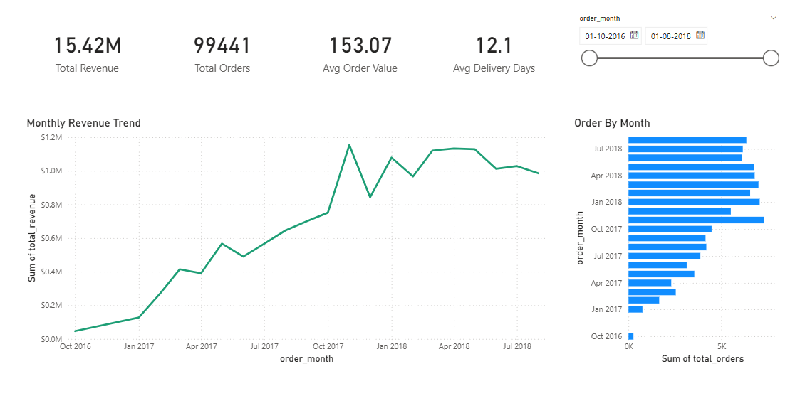
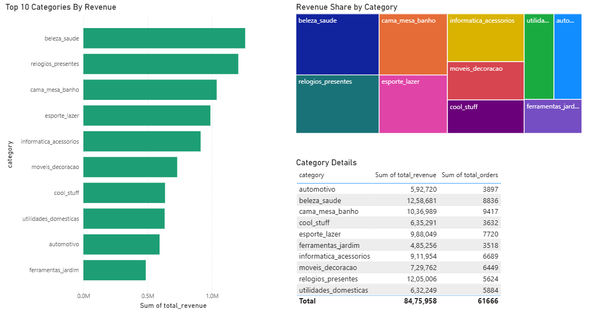
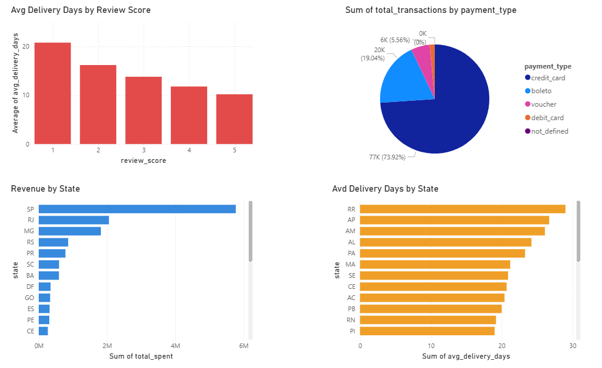
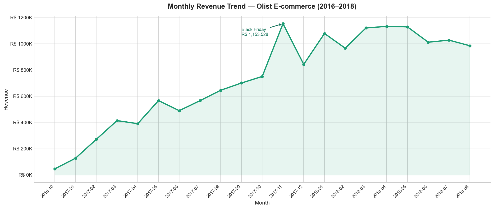

# 📊 End-to-End E-commerce Sales Analysis & Dashboard

## 🚀 Project Overview

This project presents a complete **end-to-end data analytics pipeline** for an e-commerce business using **Python, SQL, Excel, and Power BI**.

It transforms raw transactional data into **actionable business insights** through data cleaning, analysis, and interactive dashboards.

---

## 🎯 Problem Statement

E-commerce platforms generate massive volumes of data, but extracting meaningful insights for decision-making is challenging.

This project addresses:

- 📈 Revenue tracking and trend analysis  
- 👥 Customer behavior insights  
- 🚚 Delivery performance evaluation  
- 📊 Business decision support through dashboards  

---

## 🛠️ Tools & Technologies

| Tool        | Purpose |
|------------|--------|
| 🐍 Python   | Data Cleaning, EDA |
| 🗄️ SQL      | Data Extraction & Analysis |
| 📊 Excel    | Data Preprocessing |
| 📉 Power BI | Dashboard & Visualization |

---

## 📂 Project Structure


```
ecommerce-sales-analysis/
│── images/ # Dashboard screenshots
│── output/ # Processed datasets (CSV)
│── ecommerce_eda.ipynb # Python analysis notebook
│── ecommerce_report.xlsx
│── README.md
│── .gitignore
```


---

## 📂 Dataset

⚠️ Due to size limitations, the dataset is not included in this repository.

You can download it from:
👉 https://www.kaggle.com/datasets/olistbr/brazilian-ecommerce

---

## 📈 Key Performance Indicators (KPIs)

- 💰 Total Revenue  
- 📦 Total Orders  
- 📊 Average Order Value (AOV)  
- 🚚 Average Delivery Time  
- ⭐ Customer Review Score  

---

## 📊 Dashboard Preview

### 📊 Power BI Dashboard – Overview


### 📊 Power BI Dashboard – Detailed Insights


### 📊 Power BI Dashboard – Advanced Analytics


---

## 📊 Additional Visual Insights

### 🚚 Delivery Performance Analysis


### 💳 Payment Method Distribution


### 📈 Monthly Revenue Trend


---

## 📊 Business Insights

- 🚚 Faster deliveries significantly improve customer satisfaction  
- 💳 Credit cards dominate as the primary payment method  
- 🌍 Revenue is concentrated in specific regions/states  
- ⏱️ Delivery delays negatively impact review scores  
- 📈 Monthly revenue shows clear seasonal trends  

---

## 🔄 Project Workflow

1. Data Collection (Olist Dataset)  
2. Data Cleaning & Preprocessing (Python, Excel)  
3. Exploratory Data Analysis (EDA)  
4. SQL-based Data Analysis  
5. Data Visualization using Power BI  
6. Insight Generation & Reporting  

---

## 🧠 Skills Demonstrated

- Data Cleaning & Transformation  
- Exploratory Data Analysis (EDA)  
- SQL Querying & Aggregation  
- Data Visualization & Dashboarding  
- Business Insight Generation  
- End-to-End Data Pipeline Thinking  

---

## ▶️ How to Run the Project

### 1. Clone the Repository
```bash
git clone https://github.com/mloukikreddy/ecommerce-sales-analysis.git
